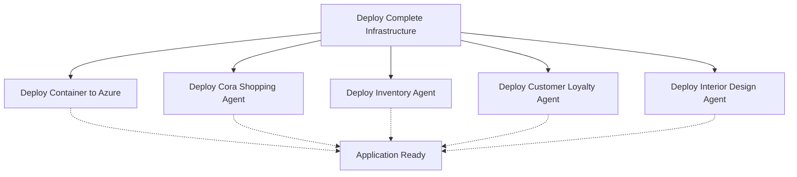

# Workflow Dependencies and Deployment Order

This document explains the workflow dependencies and deployment orchestration for the TechWorkshop L300 AI Agents project.

## 🔄 Workflow Dependency Chain

### **Primary Dependency**: Infrastructure First
All agent and application deployments now depend on successful infrastructure deployment.



## 🚀 Deployment Workflows

### **1. Infrastructure Deployment** (Primary)
**Workflow**: `deploy-infrastructure.yml`
**Triggers**: 
- Manual execution (`workflow_dispatch`)
- Must be run first before any other deployments

**What it deploys**:
- ✅ Azure Resource Groups
- ✅ Core infrastructure (Cosmos DB, Storage, AI Services)
- ✅ AI Studio Hub and Projects
- ✅ Container Registry
- ✅ App Service Plans and Web Apps
- ✅ Managed identities and role assignments
- ✅ GitHub secrets configuration

### **2. Agent Deployments** (Secondary)
All agent workflows now have **infrastructure dependencies**:

#### **Agent Workflows**:
- `deploy-cora-agent.yml` - Cora Shopping Agent
- `deploy-inventory-agent.yml` - Inventory Management Agent  
- `deploy-customer-loyalty-agent.yml` - Customer Loyalty Agent
- `deploy-interior-design-agent.yml` - Interior Design Agent

#### **Trigger Logic**:
```yaml
on:
  # Automatic trigger after infrastructure completes
  workflow_run:
    workflows: ["Deploy Complete Infrastructure"]
    types: [completed]
    branches: [main]
  
  # Manual triggers still available
  push:
    branches: [main]
    paths: [agent-specific-files]
  workflow_dispatch:
    inputs:
      force_deploy: # Override dependency check
```

### **3. Container Deployment** (Secondary)
**Workflow**: `deploy-container.yml`
**Dependencies**: Infrastructure must be deployed first
**What it deploys**:
- ✅ Application containers to Azure Container Registry
- ✅ Web application deployment to App Services
- ✅ Environment-specific configurations

## 🔒 Dependency Safety Mechanisms

### **Automatic Dependency Checking**
Each dependent workflow includes safety checks:

```bash
# Checks if triggered by infrastructure completion
if [[ "${{ github.event_name }}" == "workflow_run" ]]; then
  if [[ "${{ github.event.workflow_run.conclusion }}" != "success" ]]; then
    echo "❌ Infrastructure deployment failed - cannot deploy agent"
    exit 1
  fi
fi
```

### **Override Options**
For development and troubleshooting, each workflow supports force deployment:

```yaml
inputs:
  force_deploy:
    description: 'Force deployment without infrastructure dependency check'
    type: boolean
    default: false
```

## 📋 Deployment Scenarios

### **Scenario 1: Fresh Environment Setup**
1. **Run Infrastructure**: `Deploy Complete Infrastructure` workflow
2. **Automatic Chain**: All agent and container workflows trigger automatically
3. **Result**: Complete environment with all agents deployed

### **Scenario 2: Agent Code Updates**
1. **Push Changes**: Commit agent code changes
2. **Automatic Trigger**: Only affected agent workflow runs  
3. **Safety Check**: Verifies infrastructure exists before deploying
4. **Result**: Updated agent without full infrastructure rebuild

### **Scenario 3: Manual Agent Deployment**
1. **Manual Trigger**: Run specific agent workflow manually
2. **Assumption**: Infrastructure assumed to exist
3. **Fallback**: If deployment fails, run infrastructure first

### **Scenario 4: Force Deployment** 
1. **Override**: Use `force_deploy: true` option
2. **Skip Checks**: Bypasses infrastructure dependency validation
3. **Use Case**: Emergency deployments or development scenarios

## ⚠️ Important Deployment Rules

### **✅ DO**:
- Always run infrastructure deployment first in new environments
- Let automatic triggers handle the dependency chain
- Use force deployment only when necessary
- Monitor workflow logs for dependency check results

### **❌ DON'T**:
- Try to deploy agents without infrastructure
- Ignore dependency check warnings
- Use force deployment in production without understanding implications
- Run multiple infrastructure deployments simultaneously

## 🛠️ Troubleshooting Dependency Issues

### **Problem**: Agent deployment fails with missing resources
**Solution**: 
1. Check if infrastructure workflow completed successfully
2. Run infrastructure deployment if needed
3. Retry agent deployment

### **Problem**: Workflows not triggering automatically
**Check**: 
1. Verify workflow names match exactly: `"Deploy Complete Infrastructure"`
2. Ensure branch name is `main`
3. Check workflow permissions

### **Problem**: Dependencies seem stuck
**Resolution**:
1. Use manual triggers with `force_deploy: true`
2. Check Azure resources exist manually
3. Review workflow logs for specific errors

## 📊 Dependency Status Dashboard

### **Infrastructure Status**: 
- ✅ **Ready**: Infrastructure workflow completed successfully
- ⚠️ **Partial**: Some infrastructure components may be missing  
- ❌ **Missing**: Infrastructure deployment needed

### **Agent Dependencies**:
| Agent | Depends On | Status |
|-------|-----------|--------|
| Cora Shopping | Infrastructure + AI Studio | ✅ Configured |
| Inventory | Infrastructure + Cosmos DB | ✅ Configured |
| Customer Loyalty | Infrastructure + AI Services | ✅ Configured |
| Interior Design | Infrastructure + OpenAI | ✅ Configured |
| Container App | Infrastructure + Registry | ✅ Configured |

## 🔄 Workflow Execution Order

### **Recommended Sequence**:
1. 🏗️ **Infrastructure** (Required first)
2. 🚢 **Container Deployment** (Application foundation)  
3. 🤖 **Agent Deployments** (Can run in parallel)
   - Cora Shopping Agent
   - Inventory Agent  
   - Customer Loyalty Agent
   - Interior Design Agent

### **Timeline Expectations**:
- **Infrastructure**: ~45-60 minutes (comprehensive setup)
- **Container**: ~10-15 minutes (build and deploy)
- **Each Agent**: ~5-10 minutes (deployment and registration)
- **Total Fresh Setup**: ~60-90 minutes end-to-end

---

**🎯 Result**: The workflow dependency system ensures reliable, ordered deployments while maintaining flexibility for development and emergency scenarios.